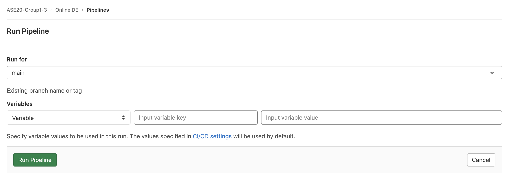

# Online IDE
## How to run the IDE
### Production
In production mode, all images will be pulled from the gitlab container registry. The online IDE is deployed on a Google Cloud Platform virtual machine at [http://35.188.164.106:8000](http://35.188.164.106:8000).

In order to trigger a new deployment of the online IDE onto the virtual machine:
1. Navigate to https://gitlab.lrz.de/ase20-group1-3/onlineide/-/pipelines/new.

2. Make sure the ```main``` branch is selected.
3. Click ```Run Pipeline```. 

This triggers all the stages needed to build, test, package, publish and deploy the online IDE on the virtual machine. It takes a while so grab a coffee while you wait. Once again, the online IDE can be found here: [http://35.188.164.106:8000](http://35.188.164.106:8000).

### Development

For development mode, all source code will be compiled and packaged as a jar. These jar files will be used later for
creating the image for every service. 

#### Before you start
Install docker and docker compose
To build, use these commands in the ```onlineide``` folder:
1. Clean and package all services
```
$ mvn clean package -DskipTests=true
```
2. Run the following command in order to build all necessary containers.
```
$ docker-compose up -d
```
In case of any errors and you need to rerun the containers, make sure you rebuild the containers using in order to overwrite the previous build.
```
$ docker-compose up --build -d
```

### Scaling up services in development
To scale up a specific service, you can run
```
$ docker-compose up -d --scale <name-of-service-to-scale>=1-5 --force-recreate
```
and can create up to five instances of the specified service.
#### Tests
We test the compiler service and these tests can be run through the following command (after cleaning and packaging the compiler service):
```
$ cd compiler
$ mvn test
```

### Services
The functional services are decomposed into six microservices. Each of them can be built, packaged and deployed independently.
### Discovery Server
This service allows for the automatic detection of network locations for the other service instances, which could have dynamically assigned addresses because of auto-scaling, failures and upgrades.
### Api Gateway
This service provides a single entry point into the system, used to handle requests by routing them to the appropriate backend service.
### Compiler Service
This service compiles Java and C code.
### Darkmode Service
This service processes toggle dark mode requests.
### Project Service
This service handles project creation, updating, deletion and fetching. It is linked to a postgres database.
### Frontend Service
This service provides the user interface for the creation of projects and source files.

## Important Endpoints
### Development
* [http://localhost:8000](http://localhost:8000) - Gateway
* [http://localhost:8761](http://localhost:8761) - Eureka Dashboard
* [http://localhost:8081](http://localhost:8081) - Compile Service
* [http://localhost:8083](http://localhost:8083) - Darkmode Service
* [http://localhost:8080](http://localhost:8080) - Project Service
* [http://localhost:8082](http://localhost:8082) - Frontend Service
